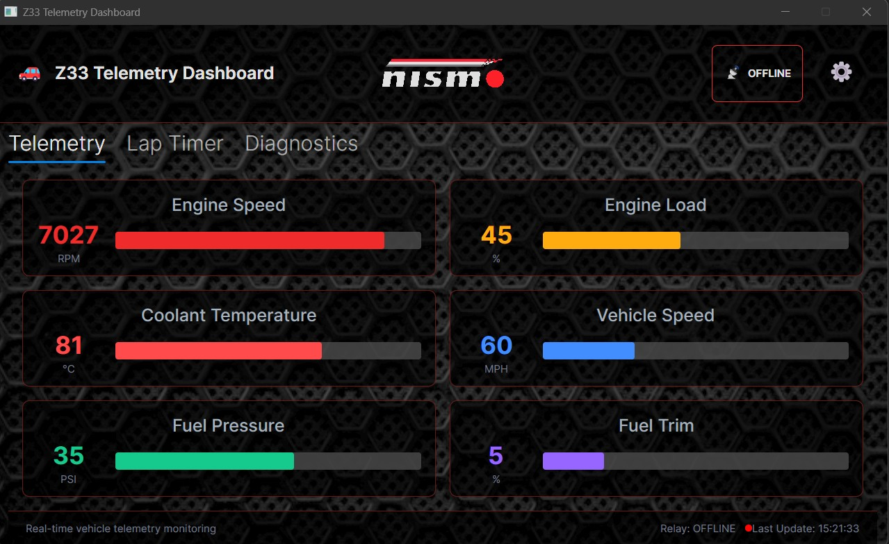
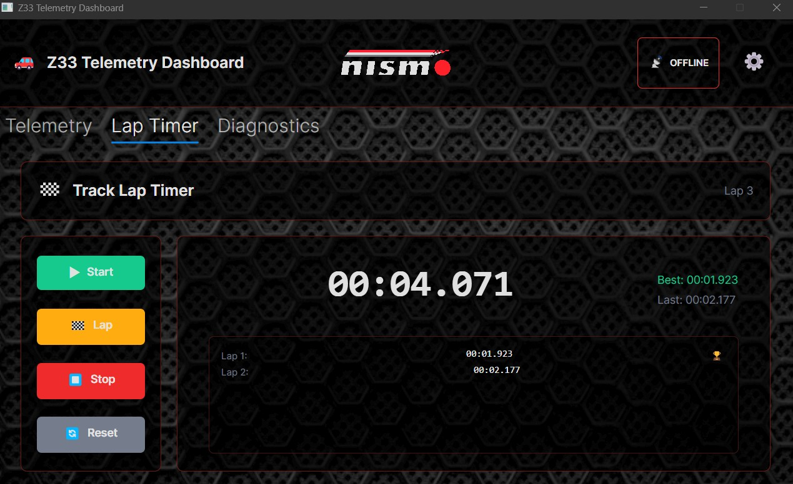
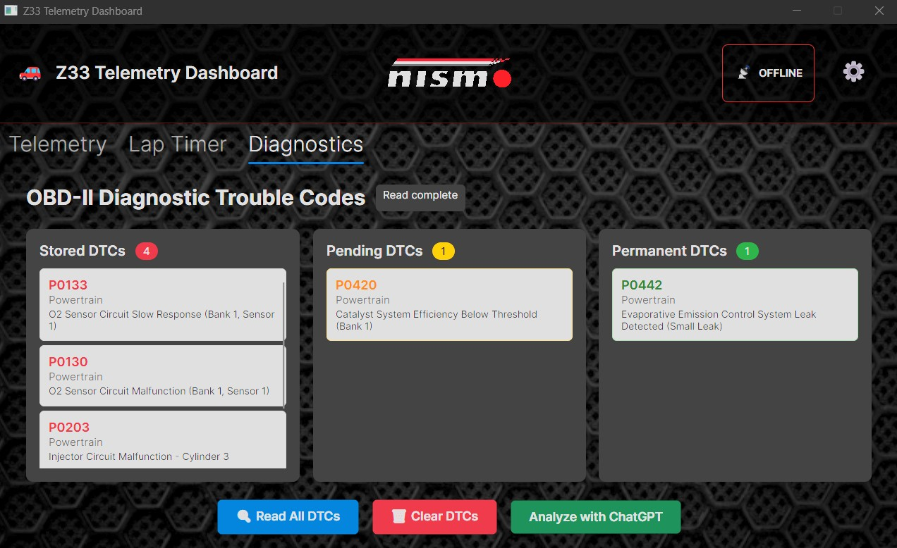
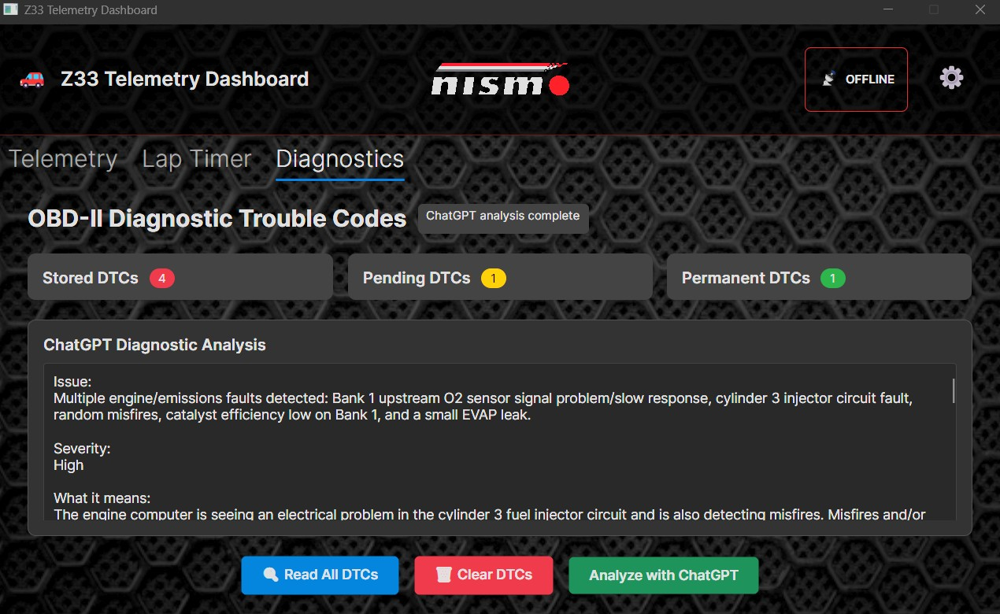

# Z33 Vehicle Telemetry Dashboard

Real-time vehicle telemetry system for a Nissan 350Z/Z33 platform. The project reads OBD-II data through an ELM327-compatible adapter, displays live telemetry in an Avalonia desktop dashboard, forwards samples to a relay service, and exposes a web dashboard through SignalR.

The solution is structured as a multi-project .NET application so the hardware communication, desktop UI, background agent, relay API, and web dashboard can evolve independently.

## Features

- Live vehicle telemetry display for RPM, speed, coolant temperature, and configurable gauge slots
- Avalonia desktop dashboard with telemetry, lap timer, diagnostics, settings, and screensaver views
- Mock OBD adapter for development without vehicle hardware
- ELM327 serial adapter support for real OBD-II polling
- Relay publishing with ingest-key validation
- SignalR streaming for browser-based telemetry viewing
- Diagnostic trouble code reading, clearing, local descriptions, and optional AI-assisted analysis
- Lap timer with smooth millisecond display updates

## Screenshots

### Telemetry Dashboard



### Lap Timer



### OBD Diagnostics



### AI-Assisted Diagnostics



## Tech Stack

- **Language:** C#
- **Runtime:** .NET 9
- **Desktop UI:** Avalonia 11
- **MVVM:** CommunityToolkit.Mvvm
- **Web/API:** ASP.NET Core
- **Realtime transport:** SignalR
- **Hardware I/O:** System.IO.Ports with ELM327-compatible OBD-II adapters
- **Configuration:** appsettings JSON files and environment variables
- **Optional AI diagnostics:** OpenAI Responses API via `OPENAI_API_KEY`

## Solution Structure

| Project | Purpose |
| --- | --- |
| `cartelemetry.core` | Shared telemetry models, OBD adapter interfaces, ELM327 adapter, mock adapter, DTC parsing, and relay publisher. |
| `cartelemetry.desktop` | Avalonia desktop dashboard for gauges, lap timer, settings, diagnostics, and telemetry transmission control. |
| `cartelemetry.relay` | Lightweight ASP.NET Core relay that accepts telemetry ingest requests and broadcasts them over SignalR. |
| `cartelemetry.webapp` | Razor/SignalR web dashboard for viewing live telemetry in a browser. |
| `cartelemetry.agent` | Background worker that streams OBD telemetry to a publisher without launching the desktop UI. |
| `elm327.tester` | Console utility for manually testing ELM327 commands and serial-port connectivity. |

## Requirements

- .NET 9 SDK
- Windows, Linux, or macOS for development
- For the desktop app: a platform supported by Avalonia
- For hardware mode: an ELM327-compatible serial/Bluetooth/USB OBD-II adapter
- For AI diagnostics: an OpenAI API key configured through `OPENAI_API_KEY`

## Quick Start

Clone the repository and restore/build the solution:

```powershell
dotnet restore Z33.sln
dotnet build Z33.sln
```

Run the desktop dashboard in mock mode:

```powershell
dotnet run --project cartelemetry.desktop
```

By default, the desktop app uses the mock OBD adapter from `cartelemetry.desktop/appsettings.json`, so the dashboard can be tested without connecting to a vehicle.

## Running The Relay

The relay accepts telemetry ingest requests and broadcasts valid samples to connected SignalR clients.

```powershell
dotnet run --project cartelemetry.relay
```

Default relay URL:

```text
http://localhost:5000
```

The relay validates requests with the `X-Ingest-Key` header. Development keys are configured in:

```text
cartelemetry.relay/appsettings.json
```

## Running The Web Dashboard

The web dashboard hosts Razor pages and a SignalR hub for live telemetry viewing.

```powershell
dotnet run --project cartelemetry.webapp
```

Default web URLs:

```text
http://localhost:5052
https://localhost:7052
```

Live telemetry page:

```text
http://localhost:5052/Telemetry
```

## Running Desktop + Web Together

For the current development setup:

1. Start the web app:

```powershell
dotnet run --project cartelemetry.webapp
```

2. Start the desktop app:

```powershell
dotnet run --project cartelemetry.desktop
```

3. Open the live telemetry page:

```text
http://localhost:5052/Telemetry
```

The desktop app publishes to the web app by default using:

```json
"Relay": {
  "BaseUrl": "http://localhost:5052",
  "VehicleId": "Z33-01",
  "SessionId": "dev-local",
  "IngestKey": "dev-testing-key-123"
}
```

## Hardware Mode

The desktop app can switch from mock telemetry to an ELM327 adapter through configuration or an environment variable.

### Option 1: Use `OBD_PORT`

Set the serial port and run the desktop app:

```powershell
$env:OBD_PORT = "COM3"
dotnet run --project cartelemetry.desktop
```

On Linux/Raspberry Pi, the port may look like:

```bash
export OBD_PORT=/dev/ttyUSB0
dotnet run --project cartelemetry.desktop
```

### Option 2: Edit Configuration

Update `cartelemetry.desktop/appsettings.json`:

```json
"Obd": {
  "UseMock": false,
  "PortName": "COM3",
  "Baud": 38400
}
```

The current ELM327 adapter setup targets ISO 9141-2, which matches the Z33 use case. Other vehicles may require changing the adapter protocol initialization.

## ELM327 Tester

Use the tester when validating the adapter, serial port, or raw OBD commands:

```powershell
dotnet run --project elm327.tester
```

Useful commands include:

- `ATZ` - reset adapter
- `ATI` - adapter information
- `ATDP` - active protocol
- `010C` - engine RPM
- `010D` - vehicle speed
- `0105` - coolant temperature
- `03` - stored DTCs
- `07` - pending DTCs
- `0A` - permanent DTCs
- `04` - clear DTCs

## Diagnostics And AI Analysis

The desktop Diagnostics tab can read stored, pending, and permanent DTCs through the active OBD adapter. It can also request a structured diagnostic summary from the OpenAI Responses API.

Set an API key before running the desktop app:

```powershell
$env:OPENAI_API_KEY = "your-api-key"
dotnet run --project cartelemetry.desktop
```

The AI diagnostic response is cached per model, vehicle, and DTC set to avoid repeated API calls for the same issue.

## Configuration Notes

Important configuration files:

- `cartelemetry.desktop/appsettings.json` - desktop relay, OpenAI, OBD, and logging settings
- `cartelemetry.desktop/appsettings.Production.json` - production-style desktop defaults
- `cartelemetry.relay/appsettings.json` - ingest keys, CORS, and relay logging
- `cartelemetry.webapp/appsettings.json` - ingest keys, CORS, and web dashboard logging

Useful environment variables:

| Variable | Purpose |
| --- | --- |
| `OBD_PORT` | Overrides configured OBD serial port and enables hardware mode. |
| `OPENAI_API_KEY` | Enables AI-assisted diagnostic analysis. |
| `ASPNETCORE_ENVIRONMENT` | Selects the appsettings environment. |
| `Z33_ENVIRONMENT` | Desktop-specific environment override used by startup detection. |

## Build And Publish

Build the full solution:

```powershell
dotnet build Z33.sln
```

Publish the desktop app:

```powershell
dotnet publish cartelemetry.desktop -c Release
```

Publish the web dashboard:

```powershell
dotnet publish cartelemetry.webapp -c Release
```

Publish the relay:

```powershell
dotnet publish cartelemetry.relay -c Release
```

## Development Notes

- The mock OBD adapter is the safest way to develop UI and relay features without a vehicle connected.
- The desktop dashboard and background agent both consume `cartelemetry.core`, so protocol and publishing changes should be made in the shared core project.
- The lap timer display is intentionally updated by a UI timer rather than telemetry samples, so milliseconds remain smooth even when OBD polling is slower.
- Sample ingest keys in configuration are development placeholders. Replace them before deploying publicly.

## Repository Status

This project is actively evolving. Planned areas for improvement include:

- Additional OBD-II PIDs for engine load, fuel pressure, and fuel trim
- More complete relay/web deployment configuration
- Expanded diagnostics workflow and DTC coverage
- GPS/motion data support for racing-line visualization
